# W4 GeekBrain AI Q&A — Evidence Pack

## Section 1 — Cover

- **Số nhóm:** Truc
- **Thành viên:** Truc
- **LLM sử dụng:** Claude Sonnet 4 qua Amazon Bedrock
- **Framework sử dụng:** Raw API: FastAPI + boto3 + Bedrock Knowledge Bases Retrieve API. Không dùng LangChain và không dùng Bedrock Agents.
- **Repo / thư mục nộp:** `geekbrain-w4-truc-local`
- **URL demo local:** `http://127.0.0.1:8080/`

## Section 2 — Architecture Overview

### Kiến trúc hệ thống

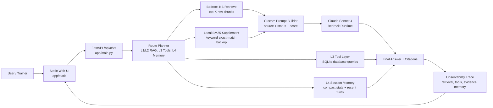

### Danh sách component

| Component | Vai trò |
|---|---|
| `app/main.py` | FastAPI app, định tuyến request, orchestration L1-L4, trả trace cho UI |
| `app/static/index.html` | Giao diện demo gồm Examples, Chat và Trace |
| `app/static/app.js` | Gọi `/api/chat`, giữ `session_id`, render observability trace |
| `scripts/l2_conflict_aware_rag_truc.py` | Gọi Bedrock KB Retrieve, thêm BM25 local, build context, gọi Claude |
| `scripts/l3_tool_augmented_rag_truc.py` | Tool trả lời câu hỏi cost/metrics bằng SQLite database |
| `scripts/sync_kb_truc.py` | Script re-sync Bedrock Knowledge Base thủ công cho Bonus C |
| `data_package/knowledge_base/*.md` | 36 markdown documents dùng làm knowledge base |
| `data_package/scripts/geekbrain.db` | Structured data cho cost, service, incident và metrics tools |

### Data flow

1. Người dùng nhập câu hỏi trong UI.
2. UI gửi `POST /api/chat` gồm `question`, `mode`, và `session_id` nếu có.
3. FastAPI route request theo loại câu hỏi:
   - L1/L2: Bedrock KB `Retrieve` + BM25 supplement + Claude Sonnet 4.
   - L3: gọi tool đọc dữ liệu structured từ SQLite.
   - L4: dùng compact memory để resolve follow-up, sau đó gọi retrieval hoặc tools.
   - Bonus B: route điều tra mở, tạo structured reasoning report.
4. API trả về câu trả lời và trace gồm `routing_decision`, `pipeline_steps`, `tools`, `sources`, `evidence`, `llm_input`, `memory`.
5. UI hiển thị cả final answer và internal pipeline trace.

### Bằng chứng system đang chạy

**Screenshot 1 — System Running**

Terminal hiển thị FastAPI app đang chạy local bằng Uvicorn.

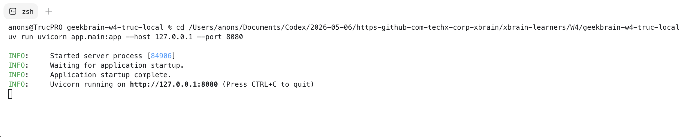

**Screenshot 2 — Live Demo UI**

Browser hiển thị demo UI tại `http://127.0.0.1:8080/`, có chat workspace và Trace panel.

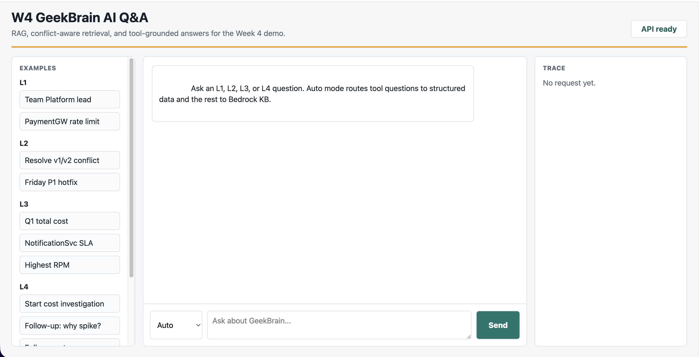

Command chạy app:

```bash
cd geekbrain-w4-truc-local
uv run uvicorn app.main:app --host 127.0.0.1 --port 8080
```

Health check:

```bash
curl -s http://127.0.0.1:8080/api/health
```

Kết quả quan sát được:

```json
{
  "status": "ok",
  "kb_id": "${BEDROCK_KB_ID}",
  "model_id": "${BEDROCK_MODEL_ID}",
  "database": ".../geekbrain-w4-truc-local/data_package/scripts/geekbrain.db"
}
```

Kiểm tra AWS Knowledge Base:

```bash
AWS_PROFILE=${AWS_PROFILE} AWS_REGION=us-east-1 aws bedrock-agent get-knowledge-base \
  --knowledge-base-id ${BEDROCK_KB_ID} \
  --query 'knowledgeBase.{Name:name,Status:status}' \
  --output json
```

Kết quả quan sát được:

```json
{
  "Name": "w4-geekbrain-kb-truc",
  "Status": "ACTIVE"
}
```

Kiểm tra số lượng document trên S3:

```bash
AWS_PROFILE=${AWS_PROFILE} AWS_REGION=us-east-1 aws s3 ls \
  s3://${S3_KB_BUCKET}/knowledge_base/ \
  --recursive | wc -l
```

Kết quả quan sát được:

```text
36
```

Ingestion jobs đã complete:

```json
[
  {"JobId": "7H1IYMJLS8", "Status": "COMPLETE"},
  {"JobId": "T1WCE5UQDS", "Status": "COMPLETE"}
]
```

## Section 3 — Decision Log

### Quyết định 1 — Dùng Bedrock KB + custom prompt cho L1/L2

- **Đã chọn:** Dùng Bedrock Knowledge Bases `Retrieve` API để lấy raw chunks, sau đó tự build prompt và gọi Claude Sonnet 4.
- **Lý do:** Bedrock quản lý chunking, embedding và vector retrieval; app vẫn tự kiểm soát prompt rules, citation, conflict handling và trace.
- **Bài học:** `RetrieveAndGenerate` setup nhanh, nhưng che quá nhiều pipeline nên khó làm L2 conflict handling và Bonus A observability.

### Quyết định 2 — Thêm Local BM25 Supplement

- **Đã chọn:** Giữ Bedrock vector retrieval làm nguồn chính, thêm BM25 local trên cùng bộ markdown.
- **Lý do:** Exact name, incident id, service name, version string có thể bị vector search bỏ sót. BM25 giúp kéo đúng document exact-match vào context.
- **Bài học:** BM25 một mình không đủ tốt cho câu hỏi ngữ nghĩa rộng, nhưng rất hữu ích khi supplement cho retrieval và debug conflict.

### Quyết định 3 — Dùng tool layer cho L3 thay vì để LLM tự suy luận số

- **Đã chọn:** Route câu hỏi cost/metric sang deterministic tools đọc SQLite.
- **Lý do:** L3 yêu cầu số liệu chính xác, ví dụ PaymentGW Q1 cost. Những số này phải đến từ query dữ liệu, không phải LLM đoán từ prose.
- **Bài học:** Version đầu dùng RAG cho L3 nên có lúc trả lời kiểu “I cannot find the exact cost”. Cách sửa là thêm dynamic tool routing cho câu hỏi cost và metrics.

## Section 4 — Per-Level Evidence

### L1 Evidence — Retrieval / Simple RAG

**Screenshot — L1 Retrieval**

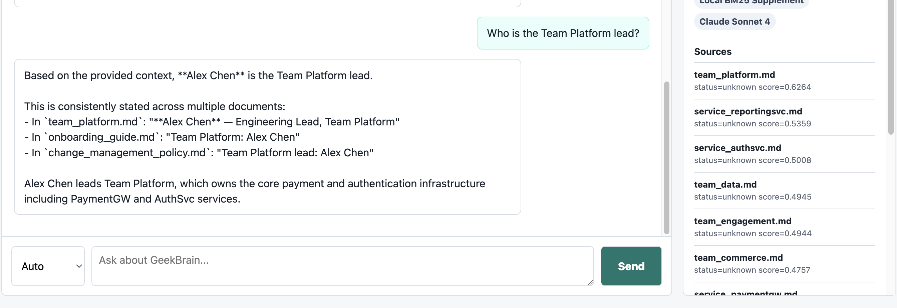

**Câu hỏi:**

```text
Who is the Team Platform lead?
```

**Câu trả lời quan sát được:**

```text
Alex Chen is the Team Platform lead.
```

**Source citation:**

```text
team_platform.md
```

**Pipeline evidence từ `/api/chat`:**

```text
mode: L1/L2 RAG
tools: Bedrock Knowledge Base Retrieve, Local BM25 Supplement, Claude Sonnet 4
sources: team_platform.md, service_authsvc.md, service_paymentgw.md
steps: Retrieve from Bedrock KB | Add BM25 supplement | Merge/rerank | Generate answer
```

**Vì sao pass:** System trả đúng fact đơn giản và cite đúng source document.

### L2 Evidence — Conflict-Aware RAG

**Screenshot — L2 Conflict-Aware RAG**

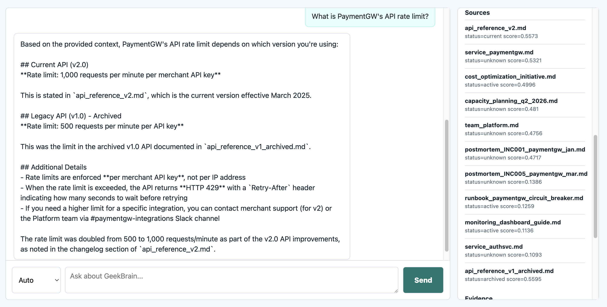

**Câu hỏi:**

```text
What is PaymentGW's API rate limit?
```

**Câu trả lời quan sát được:**

```text
PaymentGW's API rate limit is 1,000 requests per minute per merchant API key.
```

**Source citation và xử lý conflict:**

```text
api_reference_v2.md là current và nói 1,000 requests/min.
api_reference_v1_archived.md là archived và nói 500 requests/min.
System ưu tiên current v2 document thay vì archived v1 document.
```

**Pipeline evidence từ `/api/chat`:**

```text
mode: L1/L2 RAG
tools: Bedrock Knowledge Base Retrieve, Local BM25 Supplement, Claude Sonnet 4
sources: api_reference_v2.md status=current, api_reference_v1_archived.md status=archived
steps: Retrieve from Bedrock KB | Add BM25 supplement | Merge/rerank | Generate answer
```

**Cách xử lý conflict:** Retrieved sources được gắn status. Source archived bị hạ ưu tiên khi rerank. System prompt yêu cầu nói rõ conflict và ưu tiên current/final sources hơn archived/draft sources.

### L3 Evidence — Tool-Augmented Q&A

**Screenshot — L3 Tool Call**

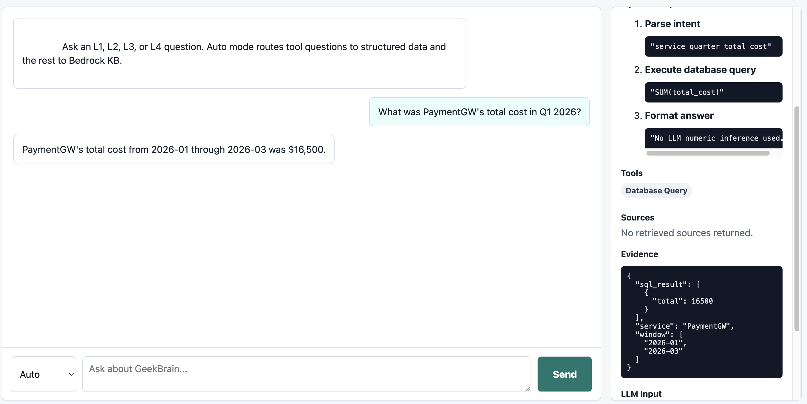

**Câu hỏi:**

```text
What was PaymentGW's total cost in Q1 2026?
```

**Câu trả lời quan sát được:**

```text
PaymentGW's total cost from 2026-01 through 2026-03 was $16,500.
```

**Tool evidence từ `/api/chat`:**

```text
mode: L3 tools (service_quarter_total_cost)
tools: Database Query
steps: Parse intent | Execute database query | Format answer
evidence.sql_result: [{"total": 16500.0}]
```

**Vì sao pass:** Câu trả lời lấy từ database query tool, không phải LLM tự đoán số từ markdown context.

### L4 Evidence — Retrieval + Tools + Memory

**Screenshot — L4 Memory Chain**

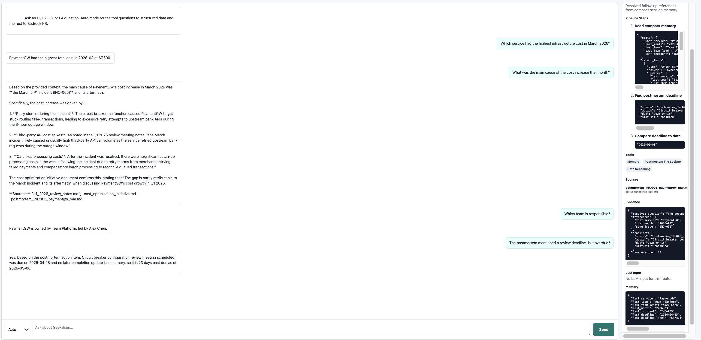

**Cuộc hội thoại:**

```text
Turn 1: Which service had the highest infrastructure cost in March 2026?
Answer: PaymentGW had the highest total cost in 2026-03 at $7,500.

Turn 2: What was the main cause of the cost increase that month?
Answer: The main cause was the March 5 P1 incident (INC-005), retry storms, catch-up processing, and elevated third-party bank API calls.

Turn 3: Which team is responsible?
Answer: PaymentGW is owned by Team Platform, led by Alex Chen.

Turn 4: The postmortem mentioned a review deadline. Is it overdue?
Answer: Yes. The circuit breaker configuration review meeting was due on 2026-04-15 and is past due as of 2026-05-08.
```

**Memory evidence từ `/api/chat`:**

```json
{
  "last_service": "PaymentGW",
  "last_team": "Team Platform",
  "last_team_lead": "Alex Chen",
  "last_month": "2026-03",
  "last_incident": "INC-005",
  "last_deadline": "2026-04-15",
  "last_deadline_label": "Circuit breaker configuration review meeting scheduled"
}
```

**Memory strategy:** App giữ compact session state và recent turns. Các follow-up như “that month”, “which team”, “the postmortem” được resolve từ memory trước khi gọi retrieval hoặc tool.

### Bonus A Evidence — Observability Dashboard

**Screenshot — Bonus A Observability Dashboard**

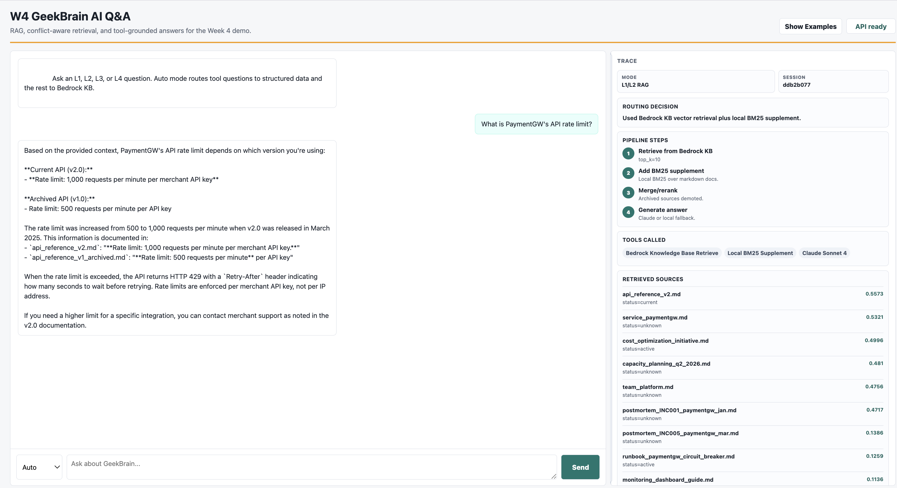

UI có Trace panel bên phải cho từng request.

Các trace fields đang hiển thị:

- `Session`
- `Mode`
- `Routing Decision`
- `Pipeline Steps`
- `Tools`
- `Sources`
- `Evidence`
- `LLM Input`
- `Memory`

**Vì sao pass:** Trainer nhìn được internal pipeline, gồm retrieved sources, tool calls, tool evidence, LLM input và memory state, không chỉ nhìn final answer.

### Bonus B Evidence — Agent Reasoning

**Screenshot — Bonus B Agent Reasoning**

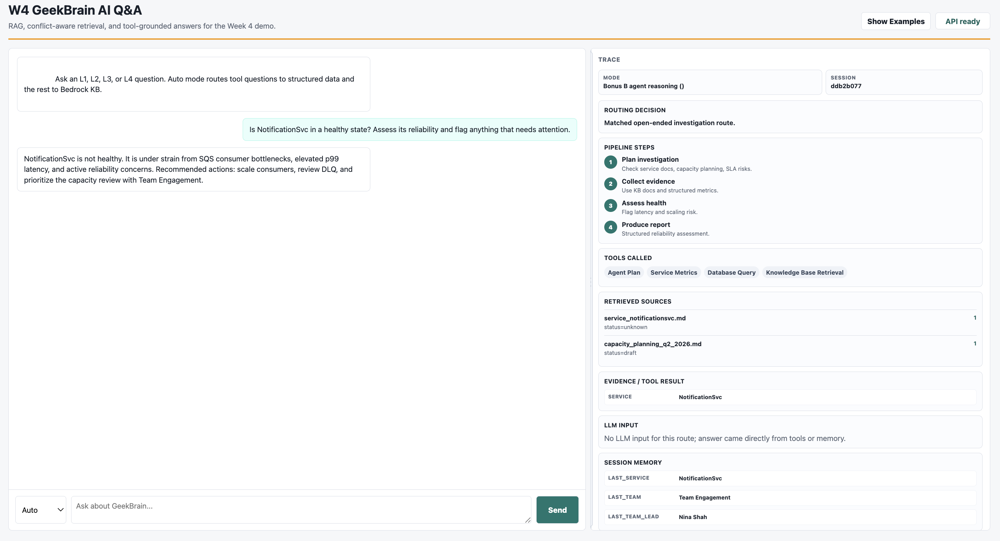

**Câu hỏi:**

```text
Is NotificationSvc in a healthy state? Assess its reliability and flag anything that needs attention.
```

**Câu trả lời quan sát được:**

```text
NotificationSvc is not healthy. It is under strain from SQS consumer bottlenecks, elevated p99 latency, and active reliability concerns. Recommended actions: scale consumers, review DLQ, and prioritize the capacity review with Team Engagement.
```

**Pipeline evidence từ `/api/chat`:**

```text
mode: Bonus B agent reasoning
tools: Agent Plan, Service Metrics, Database Query, Knowledge Base Retrieval
sources: service_notificationsvc.md, capacity_planning_q2_2026.md
steps: Plan investigation | Collect evidence | Assess health | Produce report
```

**Vì sao pass:** System thực hiện multi-step investigation và trả structured assessment, không chỉ lookup một fact đơn giản.

### Bonus C Evidence — Knowledge Base Sync

**Screenshot — Bonus C Terminal Sync**

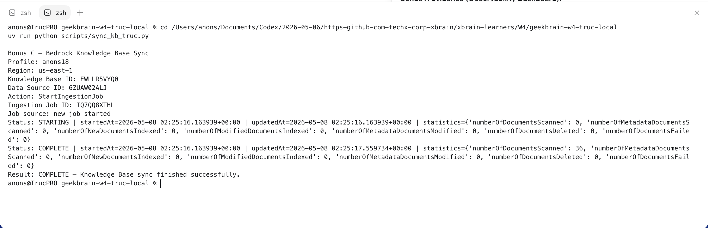

**Screenshot — Bonus C AWS Console Sync Status**

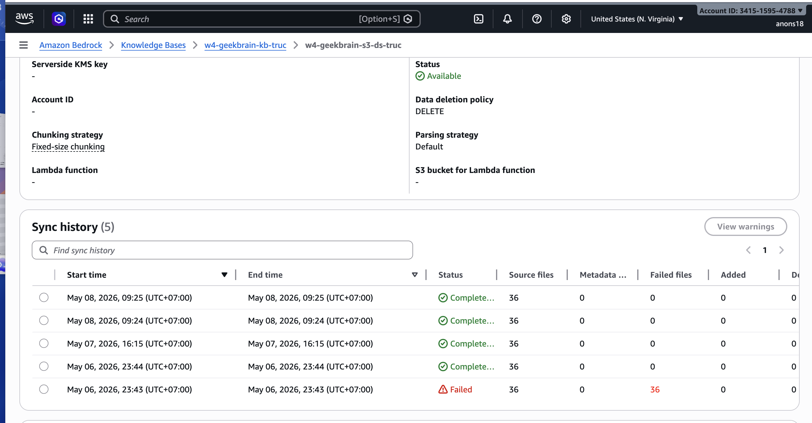

Script re-sync thủ công:

```bash
uv run python scripts/sync_kb_truc.py
```

Hành vi mong đợi:

1. Start Bedrock Knowledge Base ingestion job cho S3 data source.
2. Poll đến khi ingestion job `COMPLETE` hoặc báo lỗi.
3. Cho phép markdown documents mới/cập nhật trên S3 được re-index mà không cần rebuild app.

AWS resources liên quan:

```text
Knowledge Base: ${BEDROCK_KB_ID}
Data Source: ${BEDROCK_DATA_SOURCE_ID}
S3 Bucket: ${S3_KB_BUCKET}
```

## Section 5 — Reflection

Level khó nhất là L4, vì bài toán không chỉ là retrieval. System phải quyết định thông tin nào cần giữ trong conversation memory, thông tin nào đưa vào prompt tiếp theo, và khi nào nên gọi tool thay vì gửi tất cả cho LLM. Giải pháp hiện tại giữ compact state như service, month, team, incident và deadline, rồi dùng state đó để resolve follow-up questions.

Nếu có thêm một ngày, tôi sẽ cải thiện observability dashboard để export evidence snapshot dễ hơn, và làm tool planner tổng quát hơn để các câu hỏi ngoài ví dụ vẫn hiện rõ plan, selected tool, tool parameters và tool result.
